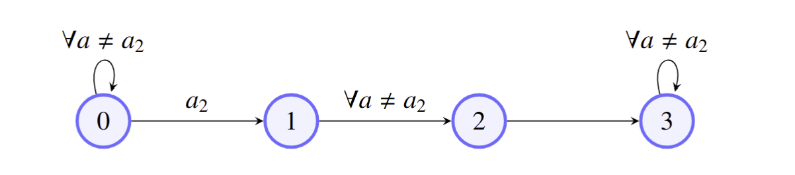

# CONTEXTUAL STATISTICAL RL

This repository is an extension of the package [StatisticalRL](https://github.com/StatisticalRL "Statistical RL Github Homepage") for the Contextual MDP (cMDP) setting, where each observation is a context-state pair $(x, s)$.

We introduce a new environment `ContextualDiscreteMDP(DiscreteMDP)` and a new base learner `ContextualAgent(Agent)`, used to implement the following learners:

- **`ETC`** : Explore-Then-Commit (ETC) learners in the cMDP setting. This class implements the common ETC workflow: an exploration phase used to collect empirical reward and transition estimates, followed by a commit phase based on a policy inferred from the explored data.
- **`IMED_RL`** : Index for Minimum Empirical Divergence for the cMDP *(not yet implemented)*.
- **`IMED_KD`** : Variant of IMED-RL using a KL-divergence-based index tailored for contextual reward and transition estimation *(not yet implemented)*.

## Contextual Markov Decision Process (cMDP)

In the cMDP setting, the agent observes a context-state pair $(x, s)$ at each timestep, where $x$ is a discrete context variable and $s$ is the underlying MDP state. Transitions depend only on $s$, while rewards can optionally depend on both $x$ and $s$.

### The `ContextualDiscreteMDP(DiscreteMDP)` environment

Extends `DiscreteMDP` with a discrete context $x$ drawn from a fixed distribution. At each step, the environment returns an observation $(x, s)$. Two flags control the contextual behavior:
- `context_is_fixed`: if `True`, the context $x$ is sampled once at reset and held constant throughout the episode.
- `reward_is_contextual`: if `True`, rewards depend on $(x, s)$ rather than $s$ alone.

### The `ContextualAgent(Agent)`

Base learner for the cMDP setting. The `learning_scope` parameter controls how rewards and transitions are statistically modeled:
- `"global"`: learning based on $s$ only.
- `"semi-local"`: reward learning based on $(x, s)$, transition learning on $s$.
- `"full-local"`: learning based on $(x, s)$ for both.

Subclasses must implement `play()` and `update()`.

## Algorithms

### `ETC` — Explore-Then-Commit

Runs in two phases:

1. **Exploration**: collects empirical reward and transition estimates via `explore()` until `stop_exploration()` triggers.
2. **Commitment**: builds a policy from the explored data via `build_committed_policy()`, then follows it with `commit()`.

We include an optional `skeleton` parameter to restrict exploration and commitment to a subset of admissible actions per state — useful when the action space is known to be partially valid.

The `GlobalETC3` learner that explores for exactly 3 timesteps is currently implemented.

### `IMED_RL` — Index for Minimum Empirical Divergence (RL)

*(not yet implemented)*

### `IMED_KD` — IMED with KL-Divergence

*(not yet implemented)*

## Structure

Mirrors the layout of **`StatisticalRL==2.2507`**:

- **environments** : This defines RL environments for the contextual setting.
- **learners** : This defines several RL learning agents.

## Installation 

Requires **Python 3.11**. Dependencies are managed with **Poetry 2.3.2**.
```bash
poetry install
```

### Test experiment

A minimal experiment is included to validate the setup. It runs a `GlobalETC3` learner against a `ContextualDiscreteMDP` with 4 states, 4 actions, and 3 contexts — loosely inspired by an agro-carbon management setting — and compares it to an oracle policy (see Figure 1).

```bash
poetry run python articles/2026_GymAgroCarbon/tests/2026_03_24_GlobalETC3_test.py
```


<figure>
  
  <figcaption align="center"><em>Figure 1: Transition graph of the toy agro-carbon cMDP used in the test experiment.</em></figcaption>
</figure>
